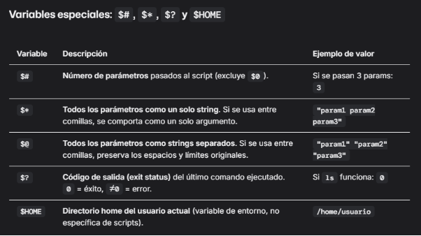
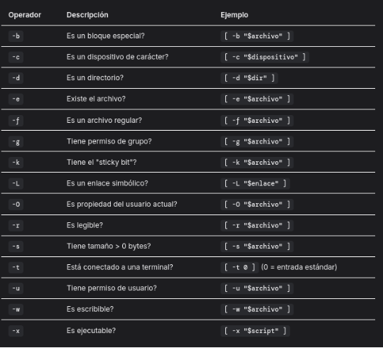
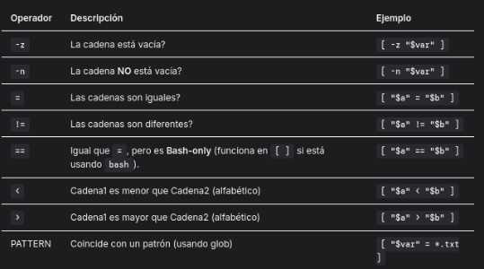
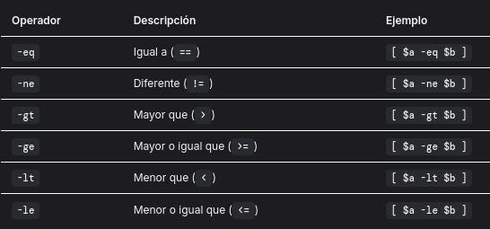
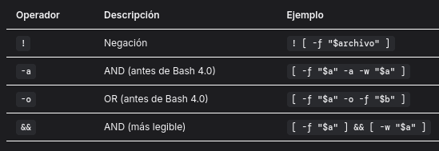
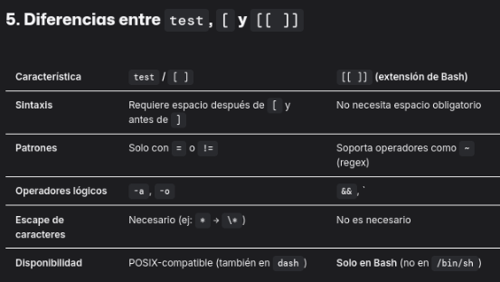
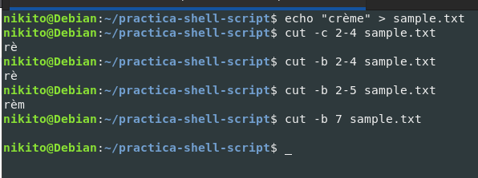

TP 1

   1) **Mencione y explique las características más relevantes de GNU/Linux.**\
      Caracteristicas mas importantes:\
          - Es un SO tipo UNIX (sistema operativo multitarea o multiusuario) pero libre\
          - Está diseñado por su misma comunidad\
          - es gratuito y de libre distribucion\
          - Existen diversas distribuciones del mismo\
          - es de código abierto (libre personalizacion)
   1) **Mencione otros sistemas operativos y compárelos con GNU/Linux en cuanto a los puntos mencionados en el inciso a.**\
      Otros SOs:\
      ` `- Windows (es unix, no esta diseñado por una comunidad abierta, no es gratuito y no es de código libre)\
          - MacOS (es unix, no esta diseñado por una comunidad abierta, no es gratuito y no es de código libre)
   1) **¿Qué es GNU?** es un SO
   1) **Indique una breve historia sobre la evolución del proyecto GNU.**\
      Iniciado por Richard Stallman en el 83, con el fin de crear un Unix libre, creó un marco regulatorio nuevo (General Public Licence), crea una fundacion para financiar su proyecto (Free Software Foundation), en los 90s crea un editor de text (Emacs), un compilador (GCC) y bibliotecas que componen un Unix tipico per faltaba el Kernel.
   1) **Explique qué es la multitarea, e indique si GNU/Linux hace uso de ella.** 

   1) **¿Qué es una distribución de GNU/Linux? Nombre al menos 4 distribuciones de GNU/Linux y cite diferencias básicas entre ellas.**\
      Una dristribucion de linux es un sistema operativo completo que incluye el kernel de linux. ej: Ubuntu, Devian, Arch, UwUntu.
   1) en tu vieja.
   1) No lo pienso leer: Debian es un sistema operativo (SO) libre para su ordenador. Un sistema operativo es un conjunto básico de programas y utilidades que hacen que un ordenador funcione. Debian usa el núcleo Linux (el núcleo es el corazón de un SO), pero la mayoría de las herramientas básicas del SO provienen del proyecto GNU. Por lo tanto, nos referimos a Debian como el sistema operativo «Debian GNU/Linux», dando crédito a todas las fuentes. Debian GNU/Linux proporciona mucho más que un simple SO: incluye un amplio rango de programas. Concretamente ofrece más de 118.000 paquetes precompilados distribuidos en un formato que hace más sencilla la instalación en un ordenador.\
      El proyecto Debian se fundó oficialmente gracias a Ian Murdock el 16-18-1993. En aquel momento, el concepto de «distribución» era algo nuevo. Ian pretendía que Debian fuese una distribución con un desarrollo abierto, en el espíritu de Linux y GNU (véase su [Manifiesto de Debian](http://www.debian.org/doc/manuals/project-history/manifesto.es.html) para más información). El proyecto GNU del FSF patrocinó la creación de Debian durante un año (Noviembre de 1994 a Noviembre de 1995). La intención era que Debian se construyese con un cuidado meticuloso, y que su desarrollo y soporte en el tiempo se realizase con el mismo cuidado. Empezó como un grupo pequeño y unido de «hackers» de código libre, y creció gradualmente hasta llegar a ser una comunidad grande y organizada de desarrolladores y usuarios de Debian. Al comienzo, Debian era la única distribución abierta a cada contribución proveniente de cualquier desarrollador o usuario, y continua siendo la distribución de referencia de los sistemas GNU/Linux que no forman una entidad comercial. Es el único proyecto grande con una constitución, un contrato social y una normativa documentada para organizar el proyecto. Debian es también la única distribución cuyos paquetes emplean información detallada de dependencias relativa a las relaciones entre paquetes para así afianzar la consistencia del sistema al actualizar. Para lograr y mantener altos niveles de calidad, Debian ha adoptado un extenso conjunto de directrices y procedimientos para empaquetar y distribuir software. Estos niveles estándar se complementan con herramientas, automatización y documentación que integran todos los elementos clave de Debian de una forma abierta y visible.
1) **Estructura de GNU/Linux:**
   1) **Nombre cuáles son los 3 componentes fundamentales de GNU/Linux.** Kernel, Shell y FileSystem.
   1) **Mencione y explique la estructura básica del Sistema Operativo GNU/Linux.**\
      La estructura basica del SO GNU/Linux consiste en un sistema modular y jerarquico compuesta por:\
      **Hardware**: componentes fisicos\
      **Kernel**: intermediario entre HW y las apps, gestiona los procesos y memoria, controla los dispositivos mediante drivers,el sistema de archivos (como y donde se almacenan) y las redes.\
      **Shell**: interfaz entre el usuario y el kernel.\
      **FileSystem (FHS):** estructura jerarquica de directorios que organiza los archivos y recursos.\
      **Utilidades y aplicaciones:** programas que permiten realizar tareas específicas.
1) 4. Kernel:
   1) **¿Cuáles son sus funciones principales?**\
      `	`Es el principal responsable de facilitar a los distintos programas [acceso seguro](https://es.wikipedia.org/wiki/Seguridad_inform%C3%A1tica) al [*hardware*](https://es.wikipedia.org/wiki/Hardware) de la [computadora](https://es.wikipedia.org/wiki/Computadora_electr%C3%B3nica) o en forma básica, es el encargado de gestionar recursos, a través de servicios de llamada al sistema.

      **¿Cuál es la versión actual?**\
      Al cierre de junio 2024 la rama estable más reciente es la 6.8.x (por ejemplo, 6.8.8).\
      **¿Cómo se definía el esquema de versionado del Kernel en versiones anteriores a la 2.4?**\
      Se usaba el esquema clásico X.Y.Z, donde\
      `	`X = versión mayor (0, 1, 2…)\
      `	`Y = versión menor\
      `	`Z = número de parche\
      A partir de la serie 2.\* se adoptó la regla\
      `	`Y par → rama estable (2.0, 2.2, 2.4…)\
      `	`Y impar → rama de desarrollo (2.1, 2.3, 2.5…)\
\
      **¿Qué cambió en el versionado que se impuso a partir de la versión 2.6?**\
      `	`Fin del esquema impar/par. Toda nueva 2.X es estable.

   - Se pasó a lanzar directamente 2.6.0 (unificando 2.5.x como trabajo de desarrollo previo).
   - Se introdujo la nomenclatura de release candidates: 2.6.0-rc1 → 2.6.0-rc2 → … → 2.6.0
   - Desde entonces cada incremento en Y (2.6.1, 2.6.2, …) es una nueva release estable, y Z sigue siendo el parche.
   - Este modelo se mantuvo hasta el salto a la serie 3.0 (en vez de llegar a 2.7), pero la idea de “sin odd/even” y de RC perdura hoy en día
   1) **¿Es posible tener más de un Kernel de GNU/Linux instalado en la misma máquina?**\
      Sí, es posible.
   1) **¿Dónde se encuentra ubicado dentro del File System?**

      Los archivos del kernel y componentes relacionados se almacenan principalmente en el directorio boot y /lib/modules.

1) **Intérprete de comandos (Shell):**
   1) **¿Qué es?**\
      Un intérprete de comandos o Shell es una interfaz entre el usuario y el sistema operativo que permite ejecutar comandos para interactuar con el sistema. Puede ser una interfaz de línea de comandos (CLI) o gráfica, aunque el término generalmente se asocia con la CLI.
   - **¿Cuáles son sus funciones?**\
     Interpretar comandos: Procesa los comandos ingresados por el usuario y los convierte en instrucciones comprensibles para el sistema operativo.
   - Automatización: Permite la creación y ejecución de scripts (archivos con comandos) para automatizar tareas repetitivas.
   - Gestión de procesos: Facilita la ejecución, monitoreo y control de procesos en el sistema.
   - Acceso a herramientas y utilidades: Proporciona acceso a programas, herramientas del sistema y utilidades externas
   - Control del entorno del usuario: Permite configurar variables de entorno, como rutas de búsqueda o preferencias.

1) **Mencione al menos 3 intérpretes de comandos que posee GNU/Linux y compárelos entre ellos.**\
   Bash (Bourne Again Shell): 

   Popularidad: Es el más común en GNU/Linux.

   Funcionalidades: Incluye historial de comandos, scripting avanzado y soporte para tareas     interactivas.

   Ventajas: Amplia documentación, compatible con scripts heredados de Bourne Shell.

   Uso principal: Ideal para usuarios generales y desarrolladores.

   Zsh (Z Shell):

   Popularidad: Cada vez más adoptado, especialmente en macOS (desde Catalina) y Linux por su personalización.

   Funcionalidades: Más personalizable que Bash, autocompletado inteligente, corrección de errores en comandos.

   Ventajas: Compatible con Bash, muy configurable, soporta temas y plugins.

   Uso principal: Para usuarios avanzados que valoran la personalización.

   Fish (Friendly Interactive Shell):

   Popularidad: Menos usado que Bash o Zsh, pero apreciado por su facilidad de uso.

   Funcionalidades: Configuración por defecto atractiva, autocompletado automático sin necesidad de configuración adicional.

   Ventajas: Interfaz amigable y moderna, no requiere mucha personalización para ser funcional.

   Uso principal: Para usuarios nuevos o aquellos que prefieren simplicidad.

1) **¿Dónde se ubican (path) los comandos propios y externos al Shell?\
   Propios:** Se encuentrar incorporados en el código del shell, no tienen path en el sistema de archivos.

   **Externos:** se encuentran ubicados en directorios de sistema ej:\
   `	`\*	/bin: Comandos básicos del sistema (e.g., ls, cat).

   \*	/usr/bin: Comandos adicionales de usuarios (e.g., python, gcc).

   \*	/sbin: Comandos administrativos (e.g., ifconfig).

1) **¿Por qué considera que el Shell no es parte del Kernel de GNU/Linux?**\
   ` `Principales razones:

   `	`- modularidad: independizar las tareas, ya que el kernel se encarga de la gestion eficiente de recursos del sistema, y la shell se encarga de comunicar al sistema con el usuario por medio de comandos.

   `	`- Seguridad: En el caso de que falle la shell, al estar independiente al kernel, el error no lo afecta.

   `	`- Se puede cambiar de shell sin tener que modificar el kernel.

1) **¿Es posible definir un intérprete de comandos distinto para cada usuario? ¿Desde dónde se define? ¿Cualquier usuario puede realizar dicha tarea?**\
   `	`Si, es posible definir un intérprete de comandos distinto para cada usuario, se define en el archivo /etc/passwd donde están los registros de usuarios, donde SOLO el Superusuario puede realizar la tarea.**\

1) **El sistema de Archivos (File System) en Linux:**
   1) **¿Qué es?**\
      Un sistema de archivos es una estructura jerarquica para organizar, almacenar y recuperar datos en un dispositivo de almacenamiento (como un disco duro, SSD, o USB). Define cómo se nombran, almacenan y acceden a los archivos y directorios, y proporciona la interfaz para administrar el espacio disponible y la estructura jerárquica.**\

   1) **¿Cuál es la estructura básica de los File System en GNU/Linux? Mencione los directorios más importantes e indique qué tipo de información se encuentra en ellos. ¿A qué hace referencia la sigla FHS?**\
      / (Raíz): Punto de partida del sistema de archivos.

      |/bin|Contiene ejecutables esenciales para todos los usuarios, como ls, cp, mv.|
      | :- | :- |
      |/boot|Archivos necesarios para el arranque del sistema, como el kernel y el cargador de arranque (grub).|
      |/dev|`  `Archivos de dispositivos que representan hardware, como discos (/dev/sda), terminales (/dev/tty).|
      |/etc|Archivos de configuración del sistema y servicios.|
      |/home|Directorios personales de los usuarios.|
      |/lib y /lib64|Bibliotecas compartidas esenciales para ejecutables del sistema.|
      |/media y /mnt|Puntos de montaje para medios extraíbles y sistemas de archivos temporales.|
      |/opt|Software adicional y opcional.|
      |/proc|Sistema de archivos virtual que expone información sobre procesos y el kernel.|
      |/root|Directorio personal del usuario root.|
      |/sbin|Ejecutables del sistema para administración y mantenimiento.|
      |/tmp|Archivos temporales.|
      |/usr|
Programas y utilidades para usuarios.

`    `Subdirectorios importantes: /usr/bin, /usr/lib, /usr/share.
|
      |/var|Archivos variables como logs, colas de impresión y datos temporales.|

\
FHS = Las siglas FHS hacen referencia al Filesystem Hierarchy Standard (Estándar de Jerarquía del Sistema de Archivos), una norma que define la estructura de directorios y su contenido en sistemas operativos

\

1) **Mencione sistemas de archivos soportados por GNU/Linux.\
   `	`-** FAT (vFAT, exFAT):  Usado en unidades USB y compatibles con múltiples sistemas operativos.

   **-** NTFS:  Sistema de archivos de Microsoft, soportado en GNU/Linux mediante herramientas como ntfs-3g.**\

1) **¿Es posible visualizar particiones del tipo FAT y NTFS (que son de Windows) en GNU/Linux?**\
   Sí — en GNU/Linux puedes ver (y normalmente leer/escribir) particiones FAT y NTFS.**\

1) **Particiones:**
   1) **Definición. Tipos de particiones. Ventajas y Desventajas.**\
      Los tipos de particiones de disco se dividen principalmente en primarias, extendidas y lógicas. Las particiones primarias son las que pueden contener un sistema operativo, las particiones extendidas sirven para crear más particiones primarias de las que originalmente se permitían (generalmente cuatro), y las particiones lógicas se crean dentro de las particiones extendidas para almacenar datos. 

      **Tipos:**

      Particiones Primarias

      Función: Se utilizan para instalar sistemas operativos y son el tipo de partición desde la que un ordenador puede arrancar. 

      Limitación: En el antiguo esquema de particionado MBR, solo se podían tener un máximo de cuatro particiones primarias en un disco duro. 

      Particiones Extendidas:

      Función: Se crearon para solucionar la limitación de cuatro particiones primarias, permitiendo tener un mayor número de divisiones en un disco duro. 

      Estructura: Solo se puede crear una partición extendida por disco duro, y dentro de ella se pueden subdividir más espacios. 

      Particiones Lógicas:

      Función: Son divisiones que se crean dentro de la partición extendida. 

      Propiedad: Cada partición lógica puede tener su propio sistema de archivos y ser utilizada para almacenar datos o instalar otros sistemas operativos.
      **\
\

   1) **¿Cómo se identifican las particiones en GNU/Linux? (Considere discos IDE, SCSI y SATA).**\
      En GNU/Linux, las particiones de un disco se identifican mediante nombres de dispositivos que se crean en el directorio /dev.

      El esquema depende del tipo de disco y del controlador, pero lo más común es esto:

      Discos y particiones en /dev

      Los discos suelen llamarse:

      |/dev/sda|primer disco (SATA/SCSI/NVMe emulado como SCSI)|
      | :- | :- |
      |/dev/sdb|segundo disco|
      |/dev/sdc … etc|c,d,...., N-esimo disco|

      Las particiones se enumeran después del nombre del disco:

      |/dev/sda1|primera partición del primer disco.|
      | :- | :- |
      |/dev/sda2|segunda partición del primer disco.|
      |/dev/sda3|primera partición del segundo disco.|

Identificación alternativa

Además del nombre en /dev, GNU/Linux ofrece identificadores persistentes (muy usados para evitar confusiones si cambia el orden de los discos):

|/dev/disk/by-uuid/|identifica particiones por su UUID único.|
| :- | :- |
|/dev/disk/by-label/|por la etiqueta del sistema de archivos.|
|/dev/disk/by-id/|por el identificador físico del dispositivo.|

Herramientas para ver particiones

|lsblk|lista discos y particiones en forma de árbol.|
| :- | :- |
|fdisk -l|muestra la tabla de particiones de los discos.|
|blkid|muestra UUIDs y etiquetas de las particiones.|

1) **¿Cuántas particiones son necesarias como mínimo para instalar GNU/Linux? Nómbrelas indicando tipo de partición, identificación, tipo de File System y punto de montaje.**\
   `	`Como mínimo, se necesitan dos particiones para instalar GNU/Linux: 

   una partición raíz (/) para el sistema operativo y una partición de intercambio (swap) para la memoria virtual.

   Sin embargo, una instalación de una sola partición para todo también es posible. La partición raíz suele usar un sistema de archivos como Ext4 y la partición de intercambio se denomina simplemente "swap".**\
\
\
\

|/bin|Contiene los binarios, esto es, los ejecutables necesarios para el funcionamiento del sistema operativo.|
| - | - |
|/boot|Es donde están ubicados los ficheros necesarios para el arranque del sistema, pero no los de configuración. Aquí se almacenan todos los ficheros que cargan primero, justo antes de cargar el *kernel*, como por ejemplo GRUB o LILO. Es recomendable que tenga su propia partición.|
|/dev|Recordad que en todos los sistemas tipo UNIX, todo es un fichero. Por lo que los dispositivos de hardware también se tratan como si fuesen un fichero, y se encuentran almacenados aquí. Al acceder, por ejemplo, a una unidad Flash USB, estamos accediendo a su fichero, tanto en la lectura como en la escritura.|
|/etc|Es un directorio clave, ya que aquí se encuentran los ficheros de configuración del sistema operativo, aunque también se pueden complementar con algunos otros ficheros ubicados en /home.|
|/home|Su función es almacenar la totalidad de los ficheros de los usuarios, exceptuando root. Tal y como hemos visto en la línea anterior, también se ubican ficheros de configuración para cada usuario.|
|/lib|Contiene bibliotecas compartidas, necesarias para los ejecutables ubicados en /bin y /sbin|
|/mnt|Aquí se ubican los puntos de montaje de los periféricos, como discos duros externos.|
|/media|Es muy similar a /mnt y tiene las mismas funciones.|
|/opt|Aquí se ubican los programas que añaden los usuarios, diferentes de los del sistema operativo.|
|/proc|Se trata de un sistema archivos virtual. Devuelve información sobre diferentes procesos y aplicaciones que están funcionando en nuestro sistema operativo.|
|/root|Es el directorio del superusuario.|
|/sbin|Almacena ficheros ejecutables que sólo pueden ejecutar el usuario root y los administradores del sistema.|
|/srv|Algunas distribuciones utilizan éste directorio para ubicar ciertos servicios. Ejemplo de ello sería un servidor web /srv/www o un servidor ftp /srv/ftp.|
|/tmp|Es donde se almacenan los ficheros temporales. Por normal general al reiniciar el sistema se elimina la información ubicada aquí.|
|/usr|Contiene los ficheros de la mayoría de programas instalados.|
|/var|Ubica generalmente información que varía con el funcionamiento del sistema. También incluye en muchos casos los directorios raíz de servidores web o colas de correo.|
|/sys|Es similar a /proc, aquí podemos encontrar información del kernel, de las particones, etcétera.|

1) **Dar ejemplos de diversos casos de particionamiento dependiendo del tipo de tarea que se deba realizar en su sistema operativo.**

|/swap (256mb al menos)|Sirven para soportar la memoria virtual. En otras palabras, los datos se escriben en una partición swap cuando no hay suficiente memoria RAM para almacenar la información que su sistema está procesando.|
| :- | :- |
|/boot|Contiene el kernel del sistema operativo junto con archivos utilizados durante el proceso de arranque. Para la mayoría de los usuarios, una partición de arranque de 250 MB es suficiente.|
|/root|Aquí es donde se localiza "/" (el directorio raíz). En esta configuración, todos los archivos (excepto aquellos almacenados en /boot) están en la partición raíz|
|Una partición home (al menos de 100 MB)|Para almacenar datos de forma independiente de los datos del sistema, cree una partición dedicada dentro de un grupo de volumen para el directorio /home. Así podrá actualizar o reinstalar Linux sin borrar archivos de datos de los usuarios.|
**\
\

1) **¿Qué tipo de software para particionar existe? Menciónelos y compare.\
   [Tipos de Particionadores](https://www.notion.so/Tipos-de-particionadores-28d5e1116d3280038f29dd459eee9381?source=copy_link)**

TP 3

1. ¿Qué es el Shell Scripting? ¿A qué tipos de tareas están orientados los script? ¿Los scripts deben compilarse? ¿Por qué?\
   `	`El Shell Scripting es la práctica de escribir programas (llamados scripts) para un shell de sistema operativo (como Bash, Zsh, etc.). Consiste en crear archivos de texto plano que contiene una secuencia de comandos del sistema, los cuales se ejecutan de forma automática y secuencial. Estos scripts permiten automatizar tareas repetitivas, administrar sistemas, procesar archivos y mucho más.

1. Investigar la funcionalidad de los comandos echo y read.
   1. ¿Cómo se indican los comentarios dentro de un script?\
      Los scripts están orientados a automatizar tareas, especialmente aquellas que son:
- Repetitivas: Como backups diarios, actualizaciones de sistema o limpieza de archivos.
- Sistemáticas: Administración de usuarios, gestión de permisos, monitoreo de recursos.
- Procesamiento de datos: Análisis de logs, conversión de formatos, generación de informes.
- Despliegues: Instalación de software, configuración de entornos.
  1. ¿Cómo se declaran y se hace referencia a variables dentro de un script?\
     Los scripts están orientados a automatizar tareas, especialmente aquellas que son:

Declaración: Asigna un valor directamente. No se usan tipos (todas son strings).\
Ejemplo: mi\_variable="Valor123"

Referencia: Usa el signo $ antes del nombre de la variable.\
Ejemplo: echo $mi\_variable imprime Valor123.

1. Crear dentro del directorio personal del usuario logueado un directorio llamado practica-shell-script y dentro de él un archivo llamado mostrar.sh cuyo contenido sea el siguiente:

|
#!/bin/bash

# Comentarios acerca de lo que hace el script

# Siempre comento mis scripts, si no lo hago hoy,

# mañana ya no me acuerdo de lo que quise hacer

echo "Introduzca su nombre y apellido:"

read nombre apellido

echo "Fecha y hora actual:"

date

echo "Su apellido y nombre es:”

echo "$apellido $nombre"

echo "Su usuario es: `whoami`"

echo "Su directorio actual es:"

|
| :- |

1. Asignar al archivo creado los permisos necesarios de manera que pueda ejecutarlo
1. Ejecutar el archivo creado de la siguiente manera: ./mostrar
1. ¿Qué resultado visualiza?
1. Las backquotes (`) entre el comando whoami ilustran el uso de la sustitución de comandos. ¿Qué significa esto?\
   `	`Los backquotes ` indican sustitución de comandos. Significa que el shell ejecuta el comando dentro de ellas y reemplaza la expresión por su salida.

En el script: echo "Su usuario es: `whoami`"

`whoami` se ejecuta primero, y su resultado (por ejemplo, usuario\_ejemplo) se sustituye en la línea.

- Es equivalente a usar el formato moderno: $(whoami) <- USAMOS ESE, muy importante si.

\

1. Realizar modificaciones al script anteriormente creado de manera de poder mostrar distintos resultados (cuál es su directorio personal, el contenido de un directorio en particular, el espacio libre en disco, etc.). Pida que se introduzcan por teclado (entrada estándar) otros datos.

   |
#!/bin/bash

# Comentarios acerca de lo que hace el script

# Siempre comento mis scripts, si no lo hago hoy,

# mañana ya no me acuerdo de lo que quise hacer

echo "Introduzca su nombre y apellido:"

read nombre apellido

echo "Fecha y hora actual:"

date

echo "Su apellido y nombre es:”

echo "$apellido $nombre"

echo "Su usuario es: `whoami`"

echo "Su directorio actual es:"

pwd

echo

echo “Todos los elementos del directorio son:”

ls $(pwd)

echo “Todos los elementos del directorio incluyendo los ocultos son:”

ls -a $(pwd)

echo “Todos los elementos del directorio con formato humano son:”

ls -h $(pwd)

echo “TODO JUNTO son:”

ls -a -h $(pwd)

echo

echo “Espacio disponible en disco en formato maquina:”

df

echo “Espacio disponible en disco en formato humano:”

df -h
|
   | :- |

\

1. Parametrización: ¿Cómo se acceden a los parámetros enviados al script al momento de su invocación? ¿Qué información contienen las variables $#, $\*, $? y $HOME dentro de un script?\
   Los parámetros pasados al script durante su invocación se acceden mediante variables especiales:
- $0: Nombre del script.
- $1: Primer parámetro.
- $2: Segundo parámetro.
- $3: Tercer parámetro, y así sucesivamente hasta $9.
- Para parámetros mayores a 9, se usan llaves: ${10}, ${11}, etc.

  

1. ¿Cual es la funcionalidad de comando exit? ¿Qué valores recibe como parámetro y cuál es su significado?

|
`   `**Cerrar el shell actual o finalizar un script**: Cuando se ejecuta el comando exit, se sale del shell o de un script, terminando su ejecución. Si estás dentro de un script, el comando exit hace que el script termine en ese punto. `   `**Fin de la ejecución de comandos**: Si estás dentro de una terminal interactiva y escribes exit, lo que hace es cerrar la sesión de la terminal y devolverte al sistema operativo o a la pantalla de login, dependiendo del contexto.

<h3>**Parámetros que recibe:**</h3> El comando **exit** puede recibir un **número entero** como parámetro, que es conocido como **código de salida** (o "exit status").</h3> **Valores posibles:   Sin parámetros**: Si no se pasa ningún parámetro, **exit** termina el proceso con el código de salida **0**, que indica **"éxito"** o que el programa se terminó sin errores.</h3> `   `**Con un parámetro (número entero)**: Se puede proporcionar un **número entero** que representará el **código de salida**. Este número es el valor que se devuelve al sistema operativo o al proceso que haya invocado el script o terminal.</h3>

<h3>**0**: Indica que todo ha ido bien, el programa o script terminó correctamente sin errores.</h3> **Cualquier número distinto de 0**: Se considera un **código de error**, lo que significa que algo salió mal. Los códigos más comunes van de 1 a 255, y cada uno puede tener un significado específico, dependiendo del programa que lo haya generado.</h3>
|
| :- |

1. El comando expr permite la evaluación de expresiones. Su sintaxis es: expr arg1 op arg2, donde arg1 y arg2 representan argumentos y op la operación de la expresión. Investigar que tipo de operaciones se pueden utilizar.

   |
El comando **expr** en Bash se utiliza para evaluar expresiones aritméticas, lógicas y de comparación. Su sintaxis básica es: expr arg1 op arg2

<h3>**Tipos de operaciones que puedes realizar con expr:**</h3>

<h4>**1. Operaciones Aritméticas:** Estas operaciones permiten realizar cálculos matemáticos básicos. Los operadores aritméticos son los siguientes:</h4>

- **Suma** (+): Suma dos números.

- Resta (-): Resta el segundo número al primero.

- **Multiplicación** (\\*): Multiplica dos números. **Nota**: El asterisco debe escaparse con una barra invertida (\\*), ya que el asterisco es un carácter especial en Bash.

- **División** (/): Divide el primer número entre el segundo. **Nota**: Este operador realiza una **división entera**, es decir, si la división no es exacta, la parte decimal se descarta.

- **Módulo** (%): Devuelve el **resto** de la división entre los dos números.

<h4>**2. Operaciones de Comparación:** Puedes usar expr para hacer comparaciones entre dos valores. Los operadores de comparación son los siguientes:</h4>

- **Igual a** (=): Comprueba si dos números son iguales.

- **Distinto a** (!=): Comprueba si dos números son distintos.

- **Mayor que** (>): Compara si el primer número es mayor que el segundo.

- **Menor que** (<): Compara si el primer número es menor que el segundo.

- **Mayor o igual que** (>=): Comprueba si el primer número es mayor o igual que el segundo.

- **Menor o igual que** (<=): Comprueba si el primer número es menor o igual que el segundo.

<h4>**3. Operaciones Lógicas:** También puedes usar **expr** para realizar evaluaciones lógicas entre valores (verdadero o falso), utilizando los operadores lógicos:</h4>

- **AND lógico** (\&): Ambos operandos deben ser verdaderos para que el resultado sea verdadero.

- **OR lógico** (|): Al menos uno de los operandos debe ser verdadero para que el resultado sea verdadero.

- **Negación lógica** (!): Niega el valor de la expresión, convirtiendo verdadero en falso y viceversa.

<h4>**4. Operaciones de cadena:** expr también puede ser utilizado para trabajar con cadenas de texto. Aquí algunos ejemplos de operaciones con cadenas:</h4>

- **Longitud de una cadena** (length): Devuelve la longitud de una cadena.

- **Concatenación de cadenas** (:): Se utiliza para concatenar dos cadenas.

- **Buscar una subcadena** (:): Buscar la posición de una subcadena en una cadena. El valor retornado es la posición inicial de la subcadena (basado en 1).

<h4>**5. Operaciones con espacios:** Es importante tener en cuenta que si los valores de las expresiones contienen espacios, estos deben ser **comillas** para asegurarse de que se interpreten correctamente.</h4>

<h3>**Resumen de los operadores:**</h3>

- **Aritméticos**: +, -, \\*, /, %

- **Comparación**: =, !=, >, <, >=, <=

- **Lógicos**: \& (AND), \| (OR), ! (NOT)

- **Cadenas**: length, : (concatenación y búsqueda)
|
   | :- |

\

1. El comando test expresion permite evaluar expresiones y generar un valor de retorno, true o false. Este comando puede ser reemplazado por el uso de corchetes de la siguiente manera [ expresión ]. Investigar qué tipo de expresiones pueden ser usadas con el comando test. Tenga en cuenta operaciones para: evaluación de \
   archivos, evaluación de cadenas de caracteres y evaluaciones numéricas.

|
1) Operaciones para archivos    

2) P/ String

3) P/ nª    

4) Se pueden combinar    

5) Diferencias    
|
| :- |

1. Estructuras de control. Investigue la sintaxis de las siguientes estructuras de control incluidas en shell scripting:\
   `	`➢ if\
   `	`➢ case\
   `	`➢ while\
   `	`➢ for\
   `	`➢ select

   |
En Bash (y en general en Shell scripting en Debian), las estructuras de control permiten modificar el flujo de ejecución de un script. Aquí te explico la sintaxis de las estructuras de control más comunes que mencionaste:

<h3>**1. Estructura if**</h3>

La estructura if se utiliza para ejecutar comandos de manera condicional.

<h4>**Sintaxis:**</h4>

if [ condición ]; then

`    `# Comandos a ejecutar si la condición es verdadera

elif [ otra\_condición ]; then

`    `# Comandos a ejecutar si la otra condición es verdadera

else

`    `# Comandos a ejecutar si ninguna de las condiciones anteriores es verdadera

fi

<h3>**2. Estructura case**</h3>

La estructura case es útil para realizar múltiples comparaciones. Se utiliza para evaluar una variable o expresión con varios patrones posibles.

<h4>**Sintaxis:**</h4>

case $variable in

`    `patrón1)

`        `# Comandos a ejecutar si coincide con patrón1

`        `;;

`    `patrón2)

`        `# Comandos a ejecutar si coincide con patrón2

`        `;;

`    `\*)

`        `# Comandos a ejecutar si no coincide con ningún patrón (opcional)

`        `;;

esac

<h3>**3. Estructura while**</h3>

El bucle while ejecuta un bloque de comandos mientras una condición sea verdadera.

<h4>**Sintaxis:**</h4>

while [ condición ]; do

`    `# Comandos a ejecutar mientras la condición sea verdadera

done

<h3>**4. Estructura for**</h3>

El bucle for se utiliza para iterar sobre una secuencia de elementos (como una lista o un rango de números).

<h4>**Sintaxis:**</h4>

# Usando un rango

for i in {1..5}; do

`    `# Comandos a ejecutar por cada valor de i

done

# Usando un rango con incremento

for (( i=1; i<=5; i++ )); do

`    `# Comandos a ejecutar por cada valor de i

done

# Iterando sobre una lista

for i in "a" "b" "c"; do

`    `# Comandos a ejecutar por cada elemento

done

<h3>**5. Estructura select**</h3>

El comando select es utilizado para crear menús interactivos donde el usuario elige una opción. Cada opción está asociada con un número y el usuario puede seleccionar el número de la opción que desee.

<h4>**Sintaxis:**</h4>

select var in opción1 opción2 opción3 ...; do

`    `# Comandos a ejecutar dependiendo de la opción seleccionada

`    `break  # Rompe el bucle después de seleccionar una opción

done
|
   | :- |

1. ¿Qué acciones realizan las sentencias break y continue dentro de un bucle? ¿Qué parámetros reciben? ¿igual que java?

   |break|Sale del bucle|No existe; usar goto o variable de control|
   | :- | :- | :- |
   |continue|Salta a la siguiente it|No existe; usar if para saltar código|
   |Parámetros|Ninguno|Ninguno|

1. ¿Qué tipo de variables existen? ¿Es shell script fuertemente tipado? ¿Se pueden definir arreglos? ¿Cómo?\
\
   **Tipos de variables:**\
   ` `En bash, **todas las variables son esencialmente cadenas de texto (strings)**, incluso si contienen números. Bash **no es fuertemente tipado**.
- Se pueden usar como números en expresiones aritméticas.
- Se pueden declarar como readonly para que sean constantes.

Ejemplo:

|
nombre="Nicolas"     # string

edad=25              # numérico (se trata como string)

readonly PI=3.14     # constante

|
| :- |
**Arreglos:** Sí, se pueden definir:

|
# Declaración

numeros=(1 2 3 4 5)

# Acceso

echo ${numeros[0]}   # 1

# Todas las posiciones

echo ${numeros[@]}   # 1 2 3 4 5

# Tamaño

echo ${#numeros[@]}  # 5
|
| :- |

1. ¿Pueden definirse funciones dentro de un script? ¿Cómo? ¿Cómo se maneja el pasaje de parámetros de una función a la otra?\
\
   **Definición de función:**

|
mi\_funcion() {

`    `echo "Hola desde la función"

}
|
| :- |

- O también:

  |
function mi\_funcion {

`    `echo "Hola"

}
|
  | :- |

**Pasaje de parámetros:**

- Se pasan como argumentos al llamar la función.
- Dentro de la función, se accede con $1, $2, … y $@ para todos.

|
saludar() {

`    `nombre=$1

`    `echo "Hola, $nombre"

}

saludar "Nicolas"  # imprime: Hola, Nicolas
|
| :- |

**Retorno de valores:**

- return devuelve un **código de salida** (0–255).
- Para devolver un valor, se usa echo y captura con $().

|
sumar() {

`    `resultado=$(( $1 + $2 ))

`    `echo $resultado

}

suma=$(sumar 5 3)

echo $suma   # 8
|
| :- |

1. Evaluación de expresiones.
   1. Realizar un script que le solicite al usuario 2 números, los lea de la entrada Standard e imprima la multiplicación, suma, resta y cual es el mayor de los números leídos.

      |
#  12. Evaluación de expresiones.

# a. Realizar un script que le solicite al usuario 2 números, los lea de

# la entrada Standard e imprima la multiplicación, suma, resta y cual es

# el mayor de los números leídos.

echo "Introduzca n1"

read n1

echo "Introduzca n2"

read n2

# Suma

suma=$(($n1+$n2))

echo "$n1 + $n2 = $suma"

# Resta

resta=$(($n1-$n2))

echo "$n1 - $n2 = $resta"

# Multiplicacion

multi=$(($n1\*$n2))

echo "$n1 \* $n2 = $multi"

# Mayor

mayor=$(($n1>$n2))

echo "$n1 > $n2 = $mayor"

|
      | :- |

   1. Modificar el script creado en el inciso anterior para que los números sean

      recibidos como parámetros. El script debe controlar que los dos parámetros sean enviados.

      |
#  12. Evaluación de expresiones.

# b. Modificar el script creado en el inciso anterior para que los números sean

# recibidos como parámetros. El script debe controlar que los dos parámetros sean enviados.

n1=$1

n2=$2

if [ $# -lt 2 ]; then

`   `echo "Papito te faltan parametros (n1,n2)"

`   `exit 1

elif [ $# -gt 2 ]; then

`   `echo "Papio te SOBRAN parametros (n1,n2)"

`   `exit 1

fi

echo "ahora si"

# Suma

suma=$(($n1+$n2))

echo "$n1 + $n2 = $suma"

# Resta

resta=$(($n1-$n2))

echo "$n1 - $n2 = $resta"

# Multiplicacion

multi=$(($n1\*$n2))

echo "$n1 \* $n2 = $multi"

# Mayor

mayor=$(($n1>$n2))

echo "$n1 > $n2 = $mayor"
|
      | :- |

   1. Realizar una calculadora que ejecute las 4 operaciones básicas: +, - ,\*, %. Esta calculadora debe funcionar recibiendo la operación y los números como parámetros

      |
#  12. Evaluación de expresiones.

# c. Realizar una calculadora que ejecute las 4 operaciones básicas: +, - ,\*, %.

# Esta calculadora debe funcionar recibiendo la operación y los números como parámetros

n1=$1

n2=$2

op=$3

if [ $# -lt 3 ]; then

`   `echo "Papito te faltan parametros (n1,n2,op)"

`   `exit 1

elif [ $# -gt 3 ]; then

`   `echo "Papio te SOBRAN parametros (n1,n2,op)"

`   `exit 1

fi

case $op in

`   `"+")

`    `echo "ahora si"

`    `# Suma

`    `suma=$(($n1+$n2))

`    `echo "$n1 + $n2 = $suma"

`   `;;

`   `"-")

`    `echo "ahora si"

`    `# Resta

`    `resta=$(($n1-$n2))

`    `echo "$n1 - $n2 = $resta"

`   `;;

`   `"\\*")

`    `echo "ahora si"

`    `# Multiplicacion

`    `multi=$(("$n1 \* $n2"))

`    `echo "$n1 \* $n2 = $multi"

`   `;;

`   `">")

`    `echo "ahora si"

`    `# Mayor

`    `mayor=$(($n1>$n2))

`    `echo "$n1 > $n2 = $mayor"

`   `;;

`   `\*)

`    `echo "Papito esa no te la conozco"

`    `echo "Operaciones: +, - , \*, >"

`   `;;

esac
|
      | :- |

\

1. Uso de las estructuras de control:
   1. Realizar un script que visualice por pantalla los números del 1 al 100 así como sus cuadrados.

      |
# 13. Uso de las estructuras de control:

# a. Realizar un script que visualice por pantalla los números del 1 al 100 así

# como sus cuadrados.

n=$1

if [ -z $n ]; then

`    `n=100

else

`    `echo "Parametro $n encontrado"

fi

for (( i=1; i<=$n; i++)); do

`    `potencia=$(($i\*$i))

`    `echo "$i $i² = $potencia"

done
|
      | :- |

   1. Crear un script que muestre 3 opciones al usuario: Listar, DondeEstoy y QuienEsta. Según la opción elegida se le debe mostrar:

➢ Listar: lista el contenido del directorio actual.

➢ DondeEstoy: muestra la ruta deldirectorio donde me encuentro ubicado.

➢ QuienEsta: muestra los usuarios conectados al sistema.

|
# Crear un script que muestre 3 opciones al usuario: Listar, DondeEstoy y QuienEsta. Según la opción elegida se le debe mostrar:

#  ➢ Listar: lista el contenido del directorio actual.

#  ➢ DondeEstoy: muestra la ruta deldirectorio donde me encuentro ubicado.

#  ➢ QuienEsta: muestra los usuarios conectados al sistema.

echo "Opciones: Listar, DondeEstoy y QuienEsta"

read input

case $input in

`   `"Listar")

`    `echo "Me llego: Listar"

`    `ls -a -h $(pwd)

`   `;;

`   `"DondeEstoy")

`    `echo "Me llego: DondeEstoy"

`    `pwd

`   `;;

`   `"QuienEsta")

`    `echo "Me llego: QuienEsta"

`    `who 

`   `;;

`   `\*)

`    `echo "Papito esa no te la conozco"

`    `echo "Opciones: Listar, DondeEstoy o QuienEsta"

`   `;;

esac 
|
| :- |

1. Crear un script que reciba como parámetro el nombre de un archivo e informe si el mismo existe o no, y en caso afirmativo indique si es un directorio o un archivo. En caso de que no exista el archivo/directorio cree un directorio con el nombre recibido como parámetro.

|
#   Crear un script que reciba como parámetro el nombre de un archivo e informe

# si el mismo existe o no, y en caso afirmativo indique si es un directorio o un archivo.

# En caso de que no exista el archivo/directorio cree un directorio con el nombre

# recibido como parámetro.

p1=$1

if [ $# -eq 0 ]; then

`        `echo "Papito no entraron parametros" 

`        `exit

else

`        `echo "Parametro: $p1"

`        `if [ -d "$p1" ]; then

`                `echo "Papito eso es un directorio"

`                `exit

`          `elif [ -f "$p1" ]; then

`                `echo "Papito eso eh un archivo"

`                `exit

`          `else

`                `echo "No papito no lo encontre, ahi te creo un directorio"

`                `mkdir "$p1"

`                `exit

`        `fi

`        `exit

fi
|
| :- |

\

1. Renombrando Archivos: haga un script que renombre solo archivos de un directorio pasado como parámetro, agregandole una CADENA, contemplando las opciones:\
   ➢ “-a CADENA”: renombra el fichero concatenando CADENA al final del nombre del archivo.\
   ➢ “-b CADENA”: renombra el fichero concatenando CADENA al comienzo del nombre del archivo.\
\
   **Ejemplos**: Si tengo los siguientes archivos: /tmp/a /tmp/b , al ejecutar: ./renombra /tmp/ -a EJ obtendré como resultado: /tmp/aEJ /tmp/bEJ. Y si ejecuto: ./renombra /tmp/ -b EJ el resultado será: /tmp/EJa /tmp/EJb

   |
#    Renombrando Archivos: haga un script que renombre solo archivos de un directorio

# pasado como parámetro, agregandole una CADENA, contemplando las opciones:

# ➢ “-a CADENA”: renombra el fichero concatenando CADENA al final del nombre del archivo.

# ➢ “-b CADENA”: renombra el fichero concatenando CADENA al comienzo del nombre del archivo.

# Ejemplos:

#  Si tengo los siguientes archivos: /tmp/a /tmp/b , al ejecutar:

# ./renombra /tmp/ -a EJ obtendré como resultado: /tmp/aEJ /tmp/bEJ.

# Y si ejecuto: ./renombra /tmp/ -b EJ el resultado será: /tmp/EJa /tmp/EJb

# ESTA MIERDA SOBREESCRIBE EL FORMATO

directorio=$1

opcion=$2

cadena=$3

if [ $# -eq 0 ]; then

`        `echo "No hay parametros"

`        `exit

else

`        `echo "Parametros encontrados: $\*"

`        `if [ ! -d "$directorio" ]; then

`                `echo "$directorio no es un directorio"

`                `exit 1

`        `fi

`        `for archivo in "$directorio"/\*; do

`                `# solo el nombre del archivo, sin ruta

`                `nombre=$(basename "$archivo")

`                `if [ "$opcion" == "-a" ]; then

`                        `echo " ------------ Opcion a $archivo"

`                        `mv "$archivo" "$directorio/${nombre}${cadena}"

`                `elif [ "$opcion" == "-b" ]; then

`                        `echo " ------------ Opcion b $archivo"

`                        `mv "$archivo" "$directorio/${cadena}${nombre}"

`                `else

`                        `echo "Error: parámetro $opcion desconocido"

`                        `exit 1

`                `fi

`                `echo "$archivo $opcion $cadena"

`        `done

`        `exit

fi
|
   | :- |

\

1. El comando cut nos permite procesar las líneas de la entrada que reciba (archivo, entrada estándar, resultado de otro comando, etc) y cortar columnas o campos, siendo posible indicar cuál es el delimitador de las mismas. Investigue los parámetros que puede recibir este comando y cite ejemplos de uso.

` `**OPCIONES DE USO:**

- usandolo con un archivo de entrada: cut [OPTION] [VALUE] [FILE]
- usandolo con el stdin: [DATA] | cut [OPTION] [VALUE]

El comando cut tiene 3 opciones principales:

`   `-c (character) – selecciona un caracter simple o multiple definido desde cada linea basado en un posicion especifica. 

`   `-b (byte) – selecciona un byte simple o multiple de cada linea.

`   `-f (field) – extrae un campo separado por un delimitador. Esta es la opcion mas usada en la practica.

` `a su vez tiene otros 3 comandos mas que no se usan tanto:

`    `-d – setea la entrada del limitador cuando se trabaja con campos. Esto actua como separador entre varios campos, el delimitador por defecto es el tabulador.

`    `–output-delimiter – setea una distinta salida del delimitador cuando se selecciona multiples campos. Si no se especifica la salida, el comando es lo mismo que -d.

`    `–complement – invierte la seleccion. En vez de incluir los bytes especificos, caracteres o campos, los excluye y retorna todo lo demas.

\

1. Realizar un script que reciba como parámetro una extensión y haga un reporte con 2 columnas, el nombre de usuario y la cantidad de archivos que posee con esa extensión. Se debe guardar el resultado en un archivo llamado reporte.txt
1. Escribir un script que al ejecutarse imprima en pantalla los nombre de los archivos que se encuentran en el directorio actual, intercambiando minúsculas por mayúsculas, además de eliminar la letra a (mayúscula o minúscula). Por ejemplo, si en el directorio actual están los siguientes archivos: \
   `	`➢ IsO \
   `	`➢ pepE \
   `	`➢ Maria\
   y ejecutó: ./ejercicio17 , se obtendrá como resultado:\
   `	`➢ iSo\
   `	`➢ PEPe\
   `	`➢ mRI\
   Ayuda: Investigar el comando tr
1. Crear un script que verifique cada 10 segundos si un usuario se ha logueado en el sistema (el nombre del usuario será pasado por parámetro). Cuando el usuario finalmente se loguee, el programa deberá mostrar el mensaje ”Usuario XXX logueado en el sistema” y salir. 
1. Escribir un Programa de “Menu de Comandos Amigable con el Usuario” llamado menú, el cual, al ser invocado, mostrará un menú con la selección para cada uno de los scripts creados en esta práctica. Las instrucciones de cómo proceder deben mostrarse junto con el menú. El menú deberá iniciarse y permanecer activo hasta que se seleccione Salir. Por ejemplo: MENU DE COMANDOS 03. Ejercicio 3 12. Evaluar Expresiones 13. Probar estructuras de control ... Ingrese la opción a ejecutar: 03
1. Realice un script que simule el comportamiento de una estructura de PILA e implemente las siguientes funciones aplicables sobre una estructura global definida en el script: ➔ push: Recibe un parámetro y lo agrega en la pila ➔ pop: Saca un elemento de la pila ➔ length: Devuelve la longitud de la pila ➔ print: Imprime todos elementos de la pila Dentro del mismo script y utilizando las funciones implementadas: 1. Agregue 10 elementos a la pila2. Saque 3 de ellos 3. Imprima la longitud de la pila 4. Luego imprima la totalidad de los elementos que en ella se encuentran.
1. ` `Dada la siguiente declaración al comienzo de un script: num=(10 3 5 7 9 3 5 4) (la cantidad de elementos del arreglo puede variar). Implemente la función productoria dentro de este script, cuya tarea sea multiplicar todos los números que el arreglo contiene. 
1. Implemente un script que recorra un arreglo compuesto por números e imprima en pantalla sólo los números pares y que cuente sólo los números impares y los informe en pantalla al finalizar el recorrido. 
1. Dada la definición de 2 vectores del mismo tamaño y cuyas longitudes no se conocen. vector1=( 1 .. N) vector2=( 1.. N) Por ejemplo: vector1=( 1 80 65 35 2 ) y vector2=( 5 98 3 41 8 ). Complete este script de manera tal de implementar la suma elemento a elemento entre ambos vectores y que la misma sea impresa en pantalla de la siguiente manera: ➢ La suma de los elementos de la posición 0 de los vectores es 6 ➢ La suma de los elementos de la posición 1 de los vectores es 178 ... ➢ La suma de los elementos de la posición 4 de los vectores es 10.

1. Realice un script que agregue en un arreglo todos los nombres de los usuarios del sistema pertenecientes al grupo “users”. Adicionalmente el script puede recibir como parámetro: ➢ “-b n”: Retorna el elemento de la posición n del arreglo si el mismo existe. Caso contrario, un mensaje de error. ➢ “-l”: Devuelve la longitud del arreglo ➢ “-i”: Imprime todos los elementos del arreglo en pantalla 
1. Escriba un script que reciba una cantidad desconocida de parámetros al momento de su invocación (debe validar que al menos se reciba uno). Cada parámetro representa la ruta absoluta de un archivo o directorio en el sistema. El script deberá iterar por todos los parámetros recibidos, y solo para aquellos parámetros que se encuentren en posiciones impares (el primero, el tercero, el verificar si el archivo o directorio existen en el sistema, imprimiendo en pantalla que tipo de objeto es (archivo o directorio). Además, deberá informar la cantidad de archivos o directorios inexistentes en el sistema.
1. Realice un script que implemente a través de la utilización de funciones las operaciones básicas sobre arreglos: ➢ inicializar: Crea un arreglo llamado array vacío ➢ agregar\_elem : Agrega al final del arreglo el parámetro recibido ➢ eliminar\_elem : Elimina del arreglo el elemento que se encuentra en la posición recibida como parámetro. Debe validar que se reciba una posición válida ➢ longitud: Imprime la longitud del arreglo en pantalla ➢ imprimir: Imprime todos los elementos del arreglo en pantalla ➢ inicializar\_Con\_Valores : Crea un arreglo con longitud y en todas las posiciones asigna el valor 
1. Realice un script que reciba como parámetro el nombre de un directorio. Deberá validar que el mismo exista y de no existir causar la terminación del script con código de error 4. Si el directorio existe deberá contar por separado la cantidad de archivos que en él se encuentran para los cuales el usuario que ejecuta el script tiene permiso de lectura y escritura, e informar dichos valores en pantalla. En caso de encontrar subdirectorios, no deberán procesarse, y tampoco deberán ser tenidos en cuenta para la suma a informar. 
1. Implemente un script que agregue a un arreglo todos los archivos del directorio /home cuya terminación sea .doc. Adicionalmente, implemente las siguientes funciones que le permitan acceder a la estructura creada: ➢ verArchivo : Imprime el archivo en pantalla si el mismo se encuentra en el arreglo. Caso contrario imprime el mensaje de error “Archivo no encontrado” y devuelve como valor de retorno 5 ➢ cantidadArchivos: Imprime la cantidad de archivos del /home con terminación .doc ➢ borrarArchivo : Consulta al usuario si quiere eliminar el archivo lógicamente. Si el usuario responde Si, elimina el elemento solo del arreglo. Si el usuario responde No, elimina el archivo del arreglo y también del FileSystem. Debe validar que el archivo exista en el arreglo. En caso de no existir, imprime el mensaje de error “Archivo no encontrado” y devuelve como valor de retorno 10 
1. Realice un script que mueva todos los programas del directorio actual (archivos ejecutables) hacia el subdirectorio “bin” del directorio HOME del usuario actualmente logueado. El script debe imprimir en pantalla los nombres de los que mueve, e indicar cuántos ha movido, o que no ha movido ninguno. Si el directorio “bin” no existe,deberá ser creado.
1. Implemente la estructura de datos Set (Conjunto de valores) en Bash. Un conjunto se define como una colección de valores únicos, es decir que solo almacena una vez cada valor, aún cuando se intente agregar el mismo valor más de una vez. La implementación debe soportar las siguientes operaciones mediante funciones:\
   `	`● initialize - inicializa el set vacío.\
   `	`● initialize\_with - inicializa el set con un conjunto de valores que recibe como argumento (debe validar que se reciba al menos uno).\
   `	`● add - Agrega un valor al conjunto, el cual recibe como argumento. No debe agregar elementos repetidos. El resultado de la operación será un éxito solo si el valor puede ser agregado al conjunto.\
   `	`● remove - Elimina uno o más valores del conjunto, los cuales recibe como argumentos. Si la operación elimina al menos un valor, se considera un éxito.\
   `	`● contains - Chequea si el conjunto contiene un valor recibido como argumento. El resultado será éxito si el valor está en el conjunto.\
   `	`● print - Imprime los elementos del conjunto, de a uno por línea.\
   `	`● print\_sorted - Imprime los elementos del conjunto, de a uno por línea y ordenados alfabéticamente.\
   `	`Tip: Investigar cómo combinar el comando sort con la función print. En un script separado, incorporar y utilizar las funciones implementadas para desarrollar un juego de bingo. El bingo deberá generar números aleatorios dentro de un rango entre 0 y un valor máximo que puede especificarse mediante un argumento del script, de manera opcional. El valor máximo no puede ser 0 ni superior a 32767, y en caso de no especificarse se tomará como valor por defecto 99. En cada ronda se generará un nuevo número que ya no haya sido utilizado y se lo cantará, imprimiendo en la salida estándar. Luego de esto, se esperará entrada del usuario para saber si se debe cantar “BINGO” para finalizar la partida o se debe cantar un nuevo numero. Al finalizar, el script debera imprimir en orden los números se cantaron hasta que se produjo el bingo. Tip: Investigar la variable de entorno $RANDOM de Bash para obtener valores aleatorios. 
1. Realice un script que reciba como argumento una lista de posibles nombres de usuarios del sistema y, para cada uno de los que efectivamente existan en el sistema y posean un directorio personal configurado que sea válido, realice las modificaciones necesarias en su directorio personal para que tenga un subdirectorio llamado “directorio\_iso” con la siguiente estructura: 

